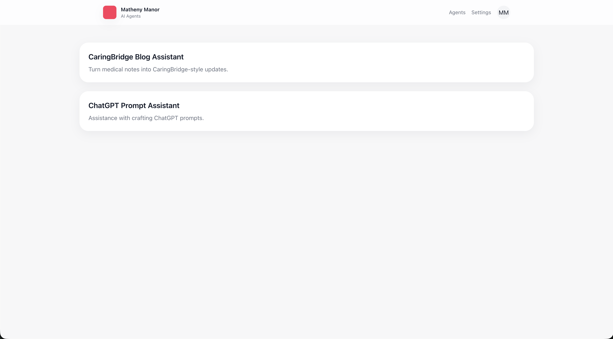

# Hey, I'm Wes 👋

Data engineering and analytics leader by day, self-hosted infrastructure tinkerer by night. I hold an **M.S. in Analytics from Georgia Tech** and have spent 18+ years in IT consulting — most of it at the intersection of data platforms, operational analytics, and the teams that build them.

I'm a firm believer that the data you generate should be **yours to query, transform, and learn from**. That philosophy drives most of what you'll find here: a personal data platform I built from the ground up, pipelines that pull from APIs I actually care about, and tools that solve problems I actually have.

---

## 🏗️ The Stack — Self-Hosted Data Platform

Everything runs on a home Ubuntu 24.04 server via **Docker Compose** — no managed services, no cloud bill, full control.

| Layer | Technology |
|-------|-----------|
| **Orchestration** | Apache Airflow |
| **Storage** | MinIO (S3-compatible object store) |
| **Warehouse** | PostgreSQL + DuckDB |
| **Transformation** | dbt |
| **Visualization** | Apache Superset (custom themed) |
| **ML Experiment Tracking** | MLflow |
| **Notebooks** | JupyterLab |
| **Reverse Proxy** | Nginx |

The entire stack is managed through parameterized wrapper scripts emphasizing DRY configuration, environment variable injection via **1Password service accounts**, and one-command orchestration.

---

## 📡 Project Spotlights

### ESPN Sports Data Platform
An end-to-end ETL pipeline that ingests ESPN API data, transforms it through a **dbt-modeled medallion architecture** (bronze → silver → gold), and serves it up in Superset dashboards. Built to scratch the itch of wanting sports analytics on my own terms rather than whatever ESPN's UI decides to show me.

`Python` · `dbt` · `PostgreSQL` · `Apache Airflow` · `Apache Superset`

---

### Apple Health Data Export System
A **FastAPI-based service** that pulls Apple Watch health metrics using Health AutoExport [Health Auto Export](https://www.healthyapps.dev/) and loads them into MinIO and DuckDB for analysis. Steps, heart rate, workouts, sleep — all queryable via SQL instead of locked inside the Health app.

`Python` · `FastAPI` · `MinIO` · `DuckDB` · `Docker`

---

### DraftKings Lineup Optimizer
A simulation-driven optimizer that generates DraftKings lineups using **weather-adjusted player projections** and Monte Carlo methods. Because fantasy sports decisions should be data-driven, not gut-driven.

`Python` · `Simulation / Monte Carlo` · `Data Modeling`

---

### AI Agent Portal
A web application built to give my family easy access to purpose-built AI agents — the first use case being a tool to help generate CaringBridge health updates for a family member. A small example of building technology that serves people, not the other way around.

`Python` · `Web Application` · `AI/LLM Integration`

---

## 🧰 What I Reach For

**Languages:** Python, SQL, R, Scala  
**Data Engineering:** Apache Airflow, dbt, DuckDB, Apache Spark  
**Cloud & Infrastructure:** AWS (Glue, S3, DMS, RDS), Docker, Linux, Nginx  
**Databases:** PostgreSQL, Oracle, SQL Server, DuckDB  
**Visualization:** Apache Superset, Splunk, ELK/OpenSearch  
**ML & Analytics:** Scikit-Learn, MLflow, Pandas, NumPy

---

## 📬 Let's Connect

- **LinkedIn:** [linkedin.com/in/wes-matheny](https://www.linkedin.com/in/wes-matheny/)
- **Email:** wmatheny07@gmail.com
- **Location:** Charleston / Summerville, SC

---

*Built with curiosity, drive, and a mass-produced refusal to let good data go unqueried.*
